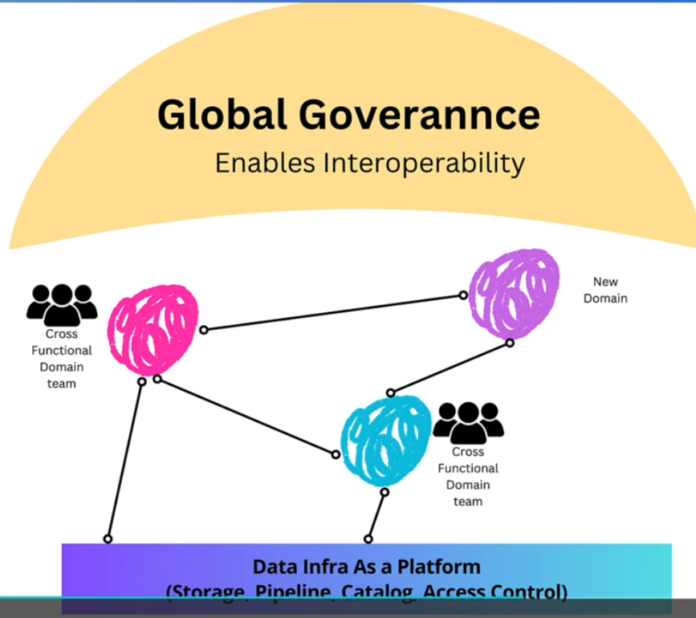
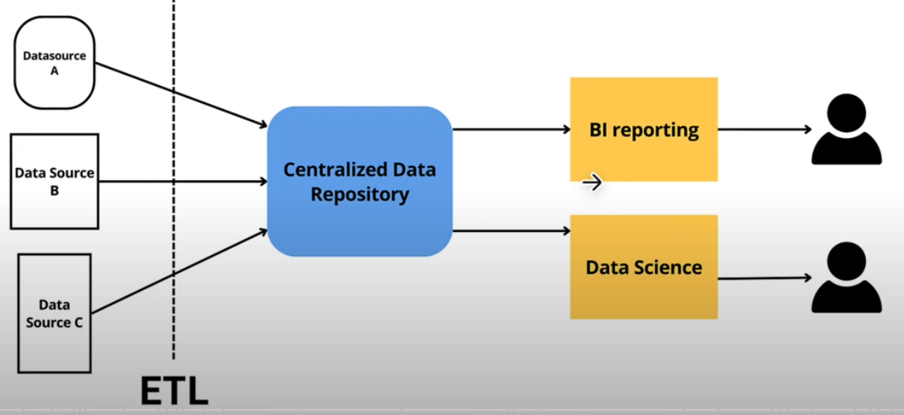
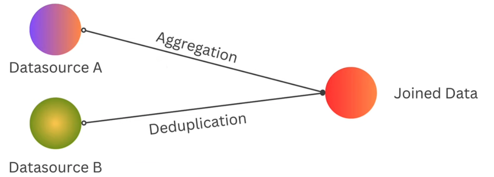
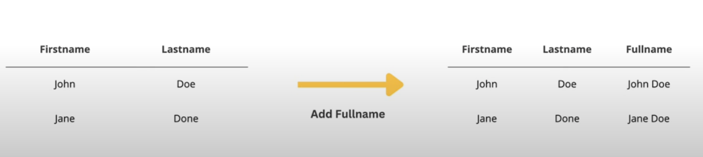
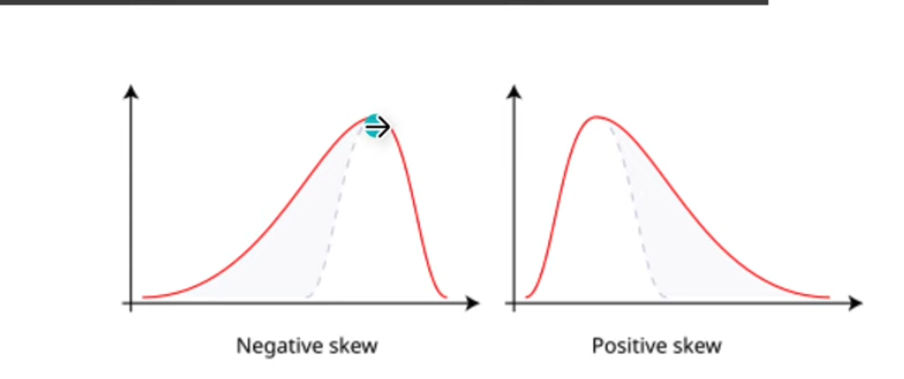
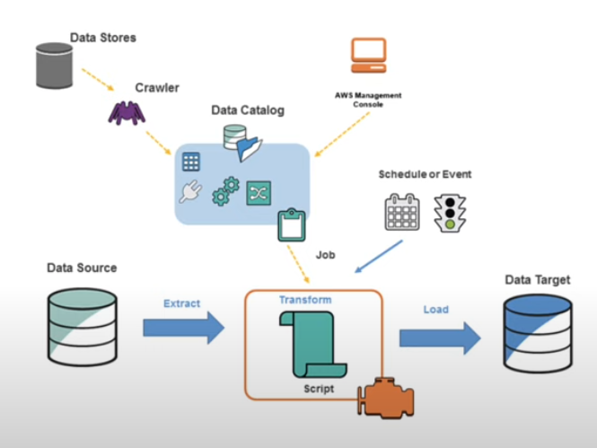

<!-- markdown-toc start - Don't edit this section. Run M-x markdown-toc-refresh-toc -->
**Table of Contents**

- [Data Engineer](#data-engineer)
    - [Data Lakehouse](#data-lakehouse)
        - [Features](#features)
        - [Examples](#examples)
    - [Data storage difference](#data-storage-difference)
    - [ETL](#etl)
    - [Data mesh](#data-mesh)
        - [What does it solve?](#what-does-it-solve)
            - [Issues](#issues)
            - [Data mesh principles](#data-mesh-principles)
    - [Orchestration](#orchestration)
        - [Examples](#examples-1)
    - [Common data formats](#common-data-formats)
    - [Common data sources](#common-data-sources)
    - [Data Modeling](#data-modeling)
        - [When should i use a new sql model? What service should i use?](#when-should-i-use-a-new-sql-model-what-service-should-i-use)
    - [Data Lineage](#data-lineage)
    - [Schema Evolution](#schema-evolution)
    - [Data Sampling](#data-sampling)
    - [Data Skewness](#data-skewness)
        - [Types of Skewness](#types-of-skewness)
        - [Addressing Skewness](#addressing-skewness)
            - [Solutions for Skewed Data:](#solutions-for-skewed-data)
        - [Solution to Skewness](#solution-to-skewness)
    - [Data validating and profiling](#data-validating-and-profiling)
    - [AWS Glue](#aws-glue)
        - [AWS Glue Data Brew](#aws-glue-data-brew)
        - [Glue Bookmarks](#glue-bookmarks)
        - [Data Processing Units (DPUs)](#data-processing-units-dpus)
        - [Data Catalogue](#data-catalogue)
        - [ETL Script](#etl-script)
        - [Why?](#why)
        - [Setup work - AWS Glue](#setup-work---aws-glue)
        - [Load Datasets - AWS Glue](#load-datasets---aws-glue)
    - [Amazon Athena](#amazon-athena)
    - [Amazon Redshift](#amazon-redshift)
        - [Scalability](#scalability)
        - [Row Distribution Styles](#row-distribution-styles)
    - [Amazon EMR](#amazon-emr)

<!-- markdown-toc end -->

# Data Engineer

## Data Lakehouse

Combines elements of datalakes and data warehouses to provide a unified data platform.

### Features
* Stores structured and unstructured data
* Schema on read and schema on write
* Real time data analytics
* Minisied data movement and duplication

### Examples
* Databricks lakehouse platform
* Google BigLake


## Data storage difference

| Feature         | Data Warehouse                       | Data Lake                                      | Data LakeHouse                                     |
|:----------------|:-------------------------------------|:-----------------------------------------------|:---------------------------------------------------|
| Data Type       | Structured                           | Structured, Semi-Structured, Unstructured      | Structured, semi-structured, unstructured          |
| Schema          | Schema-on-write                      | Schema-on-read                                 | Schema-on-read and schema-on-write                 |
| Purpose         | BI and Reporting                     | Data Science and Big Data Analytics            | BI, Reporting and Advanced Analytics               |
| Performance     | High for structured queries          | Varies but not optimised for queries           | High for both structured and unstructured queries  |
| Cost            | Higher due to processing and storage | Lower per GB but can increase with data growth | Moderate, balancing both data lakes and warehouses |
| Data Governance | Strong                               | Less defined                                   | Combines strength of both                          |

## ETL

## Data mesh
* Instead of centralised team u have product teams (product teams are cross-functional domain team).
* Global governance to ensure standards across the teams, each team elect a person to go.
* Federalised to decision for the product for each team.
* People can request access, DIAP can grate access.



### What does it solve?

* Is a decentralised apporach to managing and accessing large-scale data in an org.
* It aims to address some of the limitations of traditional centralised data architecture models by treating data as a product and foster domain-oriented data ownership.


#### Issues
* Siloed data team
  * All the data team performing ETL are performing by themselves.
* Slow responsiveness to change.
  * If business definition changes, it takes ages massived bottle on data team because they don't know the data.
* Reduced accuracy



#### Data mesh principles
* Domain-Owned Data
  * Data ownership is assigned to cross-functional teams closest to the data, ensuring those who understand it best manage it as a product.

* Data as a Product
  * Treat data with product-thinking—ensuring usability, reliability, and discoverability for consumers.

* Self-Serve Data Platform
  * Provide a scalable, user-friendly infrastructure that enables teams to autonomously publish, access, and use data products.

* Federated Computational Governance
  * uBalance autonomy with global standards—teams operate independently but align through federated decision-making for interoperability.

## Orchestration
* Refers to the automated coordinated and management of complex data workflows and processes
* Streamlines data pipelines by **scheduling**, **monitoring** and mananging dependencies.

### Examples
* Apache airflow
* AWS Step Functions

## Common data formats
* Defines how data is structured, stored and exchanged between systems.

* CSV (Common-separated values)
* JSON (Javascript object notation)
* XML (eXtensible markup language)
* Apache Parquet

## Common data sources
* Data sources are the origins from which data is collected or obtained for analysis, processing and storage
  * Databases
  * Data Warehouse
  * Data Lakes
  * Flat files (e.g. csv files)

## Data Modeling

Data modeling is the process of designing a structured representation of data to define how information is stored, organized, and managed within a system. It typically involves three key layers:

* **Conceptual Data Model**
  High-level abstraction focusing on business concepts and relationships, independent of technical implementation.

* **Logical Data Model**
  Detailed representation of data structures (entities, attributes, relationships) without database-specific considerations.

* **Physical Data Model**
  Database-specific implementation with tables, columns, indexes, and optimizations.
  * Commonly uses *Kimball methodology* for dimensional modeling in data warehousing.

### When should i use a new sql model? What service should i use?
* I have a key-value pairs and i'm building a website.
  * A: Amazon dynamodb
* I have relational, transactional data.
  * A: RDS postgres, RDS mysql, even go to aurora


## Data Lineage


* Involves tracking the flow of data through an organisation's systems and processes.
* AWS is starting to use an open source library called "deque" that can be integrated into aws glue, can track the lineages for you into glue.
* Callibra - enterprise solution for tracking, data governance, data discoverability and data lineage.

What is the best path to track data lineage?
What kind of motions do i go through for aggregation of data linear?

## Schema Evolution
* Process of managing changes to the schema of a db or data structure over time.



## Data Sampling
* A statistical technique used to select a subset of data from a larger dataset.
* Population and sample - full or slice of dataset?
* Sampling frame - what do we actually have in the dataset/population
* Sampling error - reduced accuract resutls
* Sample size


## Data Skewness

Data skewness refers to the degree of asymmetry in the probability distribution of a dataset around its mean. It indicates whether data points are concentrated more on one side of the distribution than the other.



### Types of Skewness

* **Positive Skew (Right-Skewed)**
  - The right tail is longer or fatter
  - Mean > Median > Mode
  - Asymptote  points towards the right
  - Common in scenarios like income distribution

* **Negative Skew (Left-Skewed)**
  - The left tail is longer or fatter
  - Mean < Median < Mode
  - Asymptote points towards the left
  - Seen in data like age at retirement

* **Zero Skew (Symmetrical)**
  - Perfectly balanced distribution
  - Mean = Median = Mode
  - Both sides of the distribution are mirror images

### Addressing Skewness

#### Solutions for Skewed Data:
* **Data Transformation**
  - Apply logarithmic transformation (log(x))
  - Use square root transformation (√x)
  - Try Box-Cox transformation for optimal results

* **Statistical Techniques**
  - Winsorization (capping extreme values)
  - Adding constants to adjust distribution
  - Using non-parametric statistical methods

* **Algorithm Selection**
  - Choose models robust to skewness (e.g., tree-based models)
  - Consider normalization/standardization techniques
  - Implement weighted approaches for imbalanced data

* **Business Understanding**
  - Determine if skewness represents true underlying pattern
  - Assess whether transformation is appropriate for the use case
  - Consider separate modeling for different distribution segments


### Solution to Skewness
* Bring the mean values closer to the median value

## Data validating and profiling

| Data validation                                                                    | Data Profiling                                                                                  |
|:-----------------------------------------------------------------------------------|:------------------------------------------------------------------------------------------------|
| To ensure that data is accurate consistentm and meets predefined criteria or rules | To analyse and understand the characteristics, structure, and quality of data within a dataset. |


## AWS Glue



* Fully managed ETL Service by AWS
  * No servers or infra for u as a user to provision.
* A Spark ETL Engine
* Consists of a central metadata repo known as **glue data catalogue**
* Flexible scheduler

### AWS Glue Data Brew
* Visual data preparation tool
* Aimed towards data scientists
* Prebuilt transformations
* No Code

### Glue Bookmarks
Glue Bookmarks tracks data that has already been processed during a previous run of an ETL job by persisting state information from the job run.
* This persisted state information is called a job bookmark.

### Data Processing Units (DPUs)
A single standard DPU provides 4 vCPU and 16 GB of memory whereas a high-memory DPU (M-DPU) provides 4 vCPU and 32 GB of memory.


### Data Catalogue
* A store of metedata that's required for aws to operate.
  * Tables
  * Connections
  * Actual databases

### ETL Script
* The glue job that takes data from data source and put it to a data target.

### Why?
* AWS glue offers a fully managed serverless ETL tool.
* This removes the overhead and barriers to entry, when there is a requirement for a ETL service in AWS.
* Perform ETL on data from any other aws services (s3 or even on-prem) to other aws services, database, repositories or even back to on0prem.

### Setup work - AWS Glue

1. Log into aws console
2. Navigate to cloud formation
3. Create stack
  * Upload a template file

```yaml
Description:  This template deploys an AWS Glue Execution Role. 

Parameters:
  DataEngineeringS3Arn: 
    Description: Enter the ARN of the S3 bucket which was created during when the setup code was executed. 
    Type: String  

Resources:
  GlueIAMRole:
    Type: AWS::IAM::Role
    Properties:
      RoleName: GlueDataEngineeringCertRole
      AssumeRolePolicyDocument:
        Version: "2012-10-17"
        Statement:
          - Effect: Allow
            Principal:
              Service:
                - glue.amazonaws.com
            Action:
              - sts:AssumeRole
      Policies:
        - PolicyName: DataEngineeringCertGlueServicePolicy
          PolicyDocument:
            Version: "2012-10-17"
            Statement:
              - Effect: Allow
                Action:
                  - glue:*
                  - lakeformation:*
                  - s3:GetBucketLocation
                  - s3:ListBucket
                  - s3:ListAllMyBuckets
                  - s3:GetBucketAcl
                  - ec2:DescribeVpcEndpoints
                  - ec2:DescribeRouteTables
                  - ec2:CreateNetworkInterface
                  - ec2:DeleteNetworkInterface
                  - ec2:DescribeNetworkInterfaces
                  - ec2:DescribeSecurityGroups
                  - ec2:DescribeSubnets
                  - ec2:DescribeVpcAttribute
                  - iam:ListRolePolicies
                  - iam:GetRole
                  - iam:GetRolePolicy
                  - cloudwatch:PutMetricData
                Resource: "*"
              - Effect: Allow
                Action: 
                  - s3:GetObject
                  - s3:PutObject
                  - s3:DeleteObject
                Resource: 
                  - arn:aws:s3:::aws-glue-*/*
                  - arn:aws:s3:::*/*aws-glue-*/*
                  - Ref: DataEngineeringS3Arn
                  - !Join 
                    - ''
                    - - Ref: DataEngineeringS3Arn
                      - /*
              - Effect: Allow
                Action: 
                  - s3:GetObject
                Resource: 
                  - arn:aws:s3:::crawler-public*
                  - arn:aws:s3:::aws-glue-*
              - Effect: Allow 
                Action: 
                  - logs:CreateLogGroup
                  - logs:CreateLogStream
                  - logs:PutLogEvents
                Resource: arn:aws:logs:*:*:*:/aws-glue/*
              - Effect: Allow
                Action: 
                  - ec2:CreateTags
                  - ec2:DeleteTags
                Resource: 
                  - arn:aws:ec2:*:*:network-interface/*
                  - arn:aws:ec2:*:*:security-group/*
                  - arn:aws:ec2:*:*:instance/*
                Condition: 
                  ForAllValues:StringEquals:
                    aws:TagKeys:
                    - aws-glue-service-resource
```

4. Give stack details
  * Name
  * s3 arn - needed for policy, can be found in the data engineering s3 buckets inside **properties**.
  
5. Submit - it should take 30 seconds

### Load Datasets - AWS Glue
1. Go to aws s3 
2. Go to ur bucket
3. Go to ur raw data folder
4. Upload -> add folders (NOTE: must include folder and file)

## Amazon Athena
* Athena is a serverless analytical service.
* Athena uses presto/trino/spark
* Athena uses sql syntax.

## Amazon Redshift

### Scalability
* Elastic resizing - a few minutes downtime
* Classic resizinng - hours/days downtime
* Snapshot and restore - near zero downtime

### Row Distribution Styles
* Even distribution
  * All the rows are even distrbuted in a round robin fashion
  
* Key distribution

## Amazon EMR
EMR is a managed cluster platform that simplifies running big data frameworks such as Apache Hadoop and Apache Spark as well as Presto, Trino, Flink, HBase and more.

* EMR also integrates with several other AWS services simplifying big data processing such as the AWS Glue Data Catalog which can act as your metastore.
* EMR architecture consists of a cluster which can be made up of three types of nodes.
* Although only a master node is required for EMR.
* Core nodes and Task nodes are optional.
  * A one node cluster consisting solely of a master node is possible.

### Nodes
* Master node: A node that manages the cluster by running software components to coordinate the distribution of data and tasks among other nodes 
* Core node: A node with software components that run tasks and store data in the Hadoop Distributed File System (HDFS) on your cluster. Multi-node clusters have at least one core node.
* Task node: A node with software components that only runs tasks and does not store data in HDFS. Task nodes are optional.
