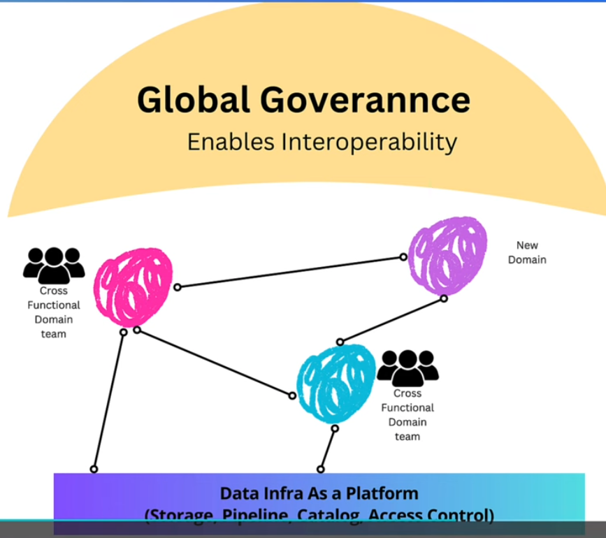

<!-- markdown-toc start - Don't edit this section. Run M-x markdown-toc-refresh-toc -->
**Table of Contents**

- [Data Engineer](#data-engineer)
    - [Data Lakehouse](#data-lakehouse)
        - [Features](#features)
        - [Examples](#examples)
    - [Data storage difference](#data-storage-difference)
    - [ETL](#etl)
    - [Data mesh](#data-mesh)
        - [What does it solve?](#what-does-it-solve)
            - [Issues](#issues)
            - [Data mesh principles](#data-mesh-principles)
    - [Orchestration](#orchestration)
        - [Examples](#examples-1)
    - [Common data formats](#common-data-formats)

<!-- markdown-toc end -->

# Data Engineer

## Data Lakehouse

Combines elements of datalakes and data warehouses to provide a unified data platform.

### Features
* Stores structured and unstructured data
* Schema on read and schema on write
* Real time data analytics
* Minisied data movement and duplication

### Examples
* Databricks lakehouse platform
* Google BigLake

## Data storage difference

| Feature   | Data Warehouse | Data Lake | Data LakeHouse |
|:----------|:---------------|:----------|:---------------|
| Data Type |                |           |                |
| Schema    |                |           |                |
| Purpose   |                |           |                |
|           |                |           |                |
|           |                |           |                |
|           |                |           |                |
|           |                |           |                |

## ETL

## Data mesh
* Instead of centralised team u have product teams (product teams are cross-functional domain team).
* Global governance to ensure standards across the teams, each team elect a person to go.
* Federalised to decision for the product for each team.
* People can request access, DIAP can grate access.

 

### What does it solve?

* Is a decentralised apporach to managing and accessing large-scale data in an org.
* It aims to address some of the limitations of traditional centralised data architecture models by treating data as a product and foster domain-oriented data ownership.

#### Issues
* Siloed data team
  * All the data team performing ETL are performing by themselves.
* Slow responsiveness to change.
  * If business definition changes, it takes ages massived bottle on data team because they don't know the data.
* Reduced accuracy

 

#### Data mesh principles
* Domain-Owned Data
  * Data ownership is assigned to cross-functional teams closest to the data, ensuring those who understand it best manage it as a product.

* Data as a Product
  * Treat data with product-thinking—ensuring usability, reliability, and discoverability for consumers.

* Self-Serve Data Platform
  * Provide a scalable, user-friendly infrastructure that enables teams to autonomously publish, access, and use data products.

* Federated Computational Governance
  * uBalance autonomy with global standards—teams operate independently but align through federated decision-making for interoperability.

## Orchestration
* Refers to the automated coordinated and management of complex data workflows and processes
* Streamlines data pipelines by **scheduling**, **monitoring** and mananging dependencies.

### Examples
* Apache airflow
* AWS Step Functions

## Common data formats
* Defines how data is structured, stored and exchanged between systems.

* CSV (Common-separated values)
* JSON (Javascript object notation)
* XML (eXtensible markup language)
* Apache Parquet

## Common data sources
* Data sources are the origins from which data is collected or obtained for analysis, processing and storage
  * Databases
  * Data Warehouse
  * Data Lakes
  * Flat files (e.g. csv files)
  
## Data Modeling

Data modeling is the process of designing a structured representation of data to define how information is stored, organized, and managed within a system. It typically involves three key layers:

* **Conceptual Data Model**
  High-level abstraction focusing on business concepts and relationships, independent of technical implementation.

* **Logical Data Model**
  Detailed representation of data structures (entities, attributes, relationships) without database-specific considerations.

* **Physical Data Model**
  Database-specific implementation with tables, columns, indexes, and optimizations.
  * Commonly uses *Kimball methodology* for dimensional modeling in data warehousing.
  
### When should i use a new sql model? What service should i use?
* I have a key-value pairs and i'm building a website.
  * A: Amazon dynamodb
* I have relational, transactional data.
  * A: RDS postgres, RDS mysql, even go to aurora
  
  
## Data Lineage

* Involves tracking the flow of data through an organisation's systems and processes.
* AWS is starting to use an open source library called "deque" that can be integrated into aws glue, can track the lineages for you into glue.
* Callibra - enterprise solution for tracking, data governance, data discoverability and data lineage.

What is the best path to track data lineage?
What kind of motions do i go through for aggregation of data linear?

## Schema Evolution
* Process of managing changes to the schema of a db or data structure over time.

## Data Sampling
* A statistical technique used to select a subset of data from a larger dataset.
* Population and sample - full or slice of dataset?
* Sampling frame - what do we actually have in the dataset/population
* Sampling error - reduced accuract resutls
* Sample size

## Data Skewness
* Refers to the asymmetry in the distrubution of data values around the mean.

 

* Position skew is when asymptote is towards the right.
* Negative skew is when asymptote is towards the legt.

### Solution to Skewness
* Bring the mean values closer to the median value

## Data validating and profiling

| Data validation                                                                    | Data Profiling                                                                                  |
|:-----------------------------------------------------------------------------------|:------------------------------------------------------------------------------------------------|
| To ensure that data is accurate consistentm and meets predefined criteria or rules | To analyse and understand the characteristics, structure, and quality of data within a dataset. |

