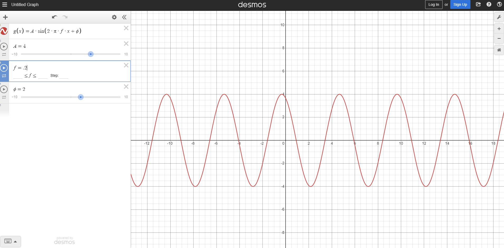
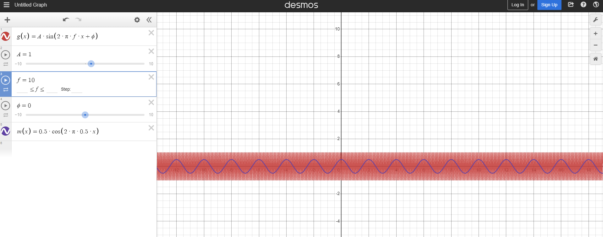
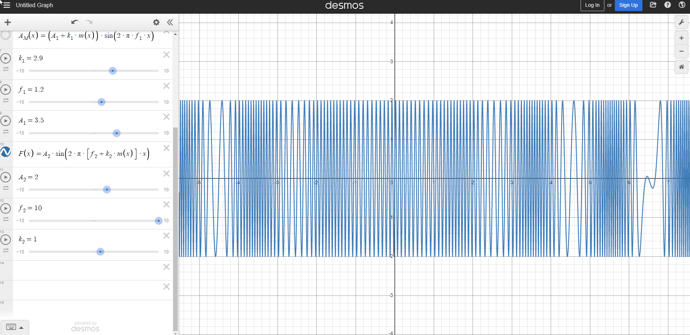
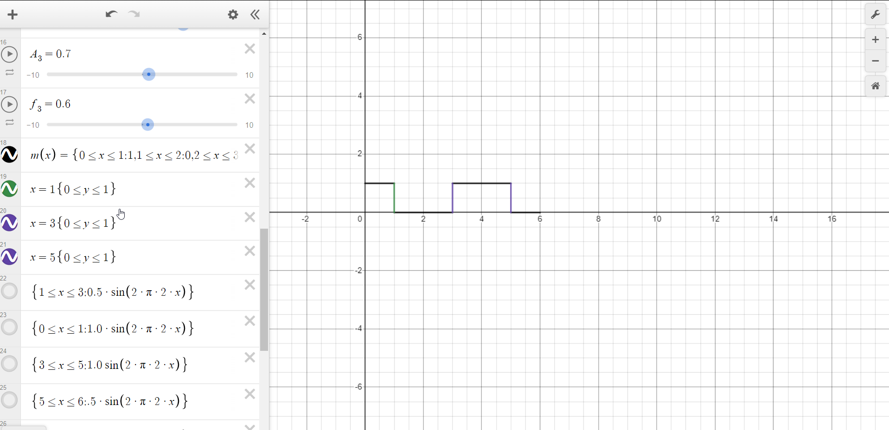
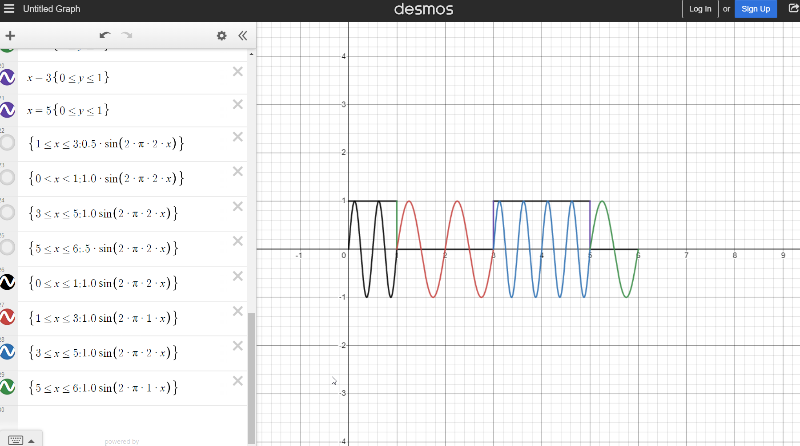
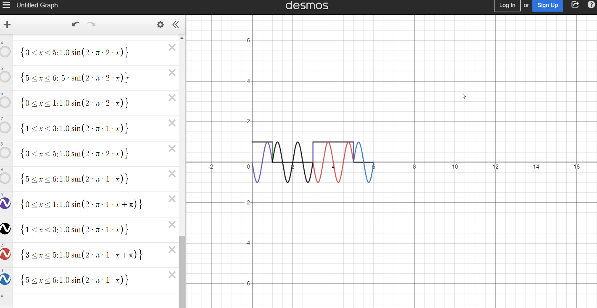

# Lab 1

<!-- markdown-toc start - Don't edit this section. Run M-x markdown-toc-refresh-toc -->
**Table of Contents**

- [Lab 1](#lab-1)
    - [Notes](#notes)
        - [Why modulate?](#why-modulate)
    - [Task 1](#task-1)
        - [Step 1](#step-1)
        - [Step 2](#step-2)
    - [Analog Modulation Techniques](#analog-modulation-techniques)
        - [Step 3](#step-3)
        - [Step 4](#step-4)
        - [Step 5](#step-5)
        - [Step 6](#step-6)
        - [Step 7](#step-7)
        - [Step 8](#step-8)
        - [Step 9](#step-9)
        - [Step 10](#step-10)
        - [Step 11](#step-11)

<!-- markdown-toc end -->
## Notes
### Why modulate?

* Ensure that signal can be transimitted over longer distances by preventing interference
* Can allow signal to be used in different electromagnetive mediums like light and sound.

## Task 1

### Step 1

### Step 2
* When amplitude is altered the lowest and the highest point of the graph changes.

* When frequency is decreased is graph becomes elongated and vice versa.

* When phase shift phi is changed, the graph phases to either left or right. Positve phi shifts left and vice versa.

## Analog Modulation Techniques

### Step 3

### Step 4

* When A_1 changes:
  * This represents the amplitude of the amplification
  * The amplitude to the signal is either increased or decrease accordingly

* When K_1 changes
  * This represents the sensitivity of the modulation
  * It gets thinner and taller accordingly

* When f_1 changes
  * The frequency (bandwidth?) changes

### Step 5

* A_2 is the amplitude to the carrier signal
    * When this values is changed then the different between the lowest and highest value becomes greater

* f_2 is the frequency of the carrier signal
    * When this value is lowered the spectrum of signal would become wider, the deviation of the FM signal would increase as well. The original amplitude of the signal would need to be higher to make the carrier wave the same.

* k_2 is the sensitivity of the modulator.
  * Changing the value of k2 alters the frequency deviation accordingly

### Step 6

* A_3 is the amplitude to the carrier signal
    * When this values is changed then the different between the lowest and highest value becomes greater

* f_3 is the frequency of the carrier signal
    * When this value is lowered the spectrum of signal would become wider, the deviation of the FM signal would increase as well. The amplitude of the signal would be higher.

* k_3 is the sensitivity of the modulator.
  * Changing the value of k3 alters the frequency deviation accordingly

### Step 7

### Step 8
* Using different different signals of different amplitude to represent a 1 or 0

### Step 9

* Using different frequency to signal either a 1 or 0

### Step 10
* Using phase shift to signal either a 1 or 0

### Step 11
1. Amplitude-shift keying
   * Using different amplitude signals to represent either a 0 or 1.
   * It is cheap to produce
   * It is more susceptible to noise
2. Frequency-shift keying
   * Using different frequency signals to represent either a 0 or 1.
   * It is less susceptible to noise
3. Phase-shift keying
   * Shifting to a different phase to represent either a 0 or 1.
   * It is less susceptible to noise
   * It is less commonly used
