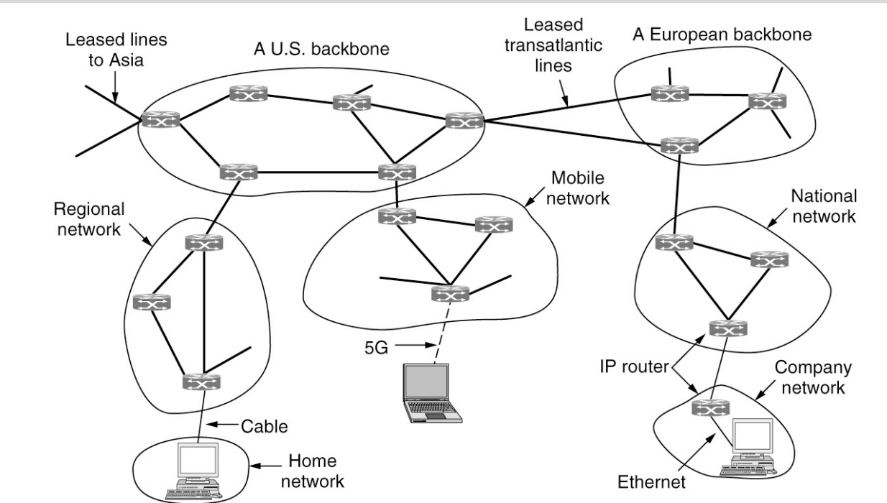

# Network Layer

<!-- markdown-toc start - Don't edit this section. Run M-x markdown-toc-refresh-toc -->
**Table of Contents**

- [Network Layer](#network-layer)
    - [10 Principals](#10-principals)
    - [Components of Network Layer](#components-of-network-layer)
    - [The Network Layer in the internet](#the-network-layer-in-the-internet)

<!-- markdown-toc end -->

## 10 Principals

1. Make sure it works
2. Keep it simple
3. Make clear choices
4. Exploit modularity
5. Expect heterogeneity
6. Avoid static options with parameters
7. Look for a good design; it need not be perfect
8. Be strict when sending and tolerant when receiving
9. Think about scalability
10. Consider performance and cost

## Components of Network Layer
1. IP Version 4 Protocol
2. IP Addresses
3. IP Version 6 Protocol
4. Internet control Protocols
5. Label switching and MPLS

## The Network Layer in the internet 

 
