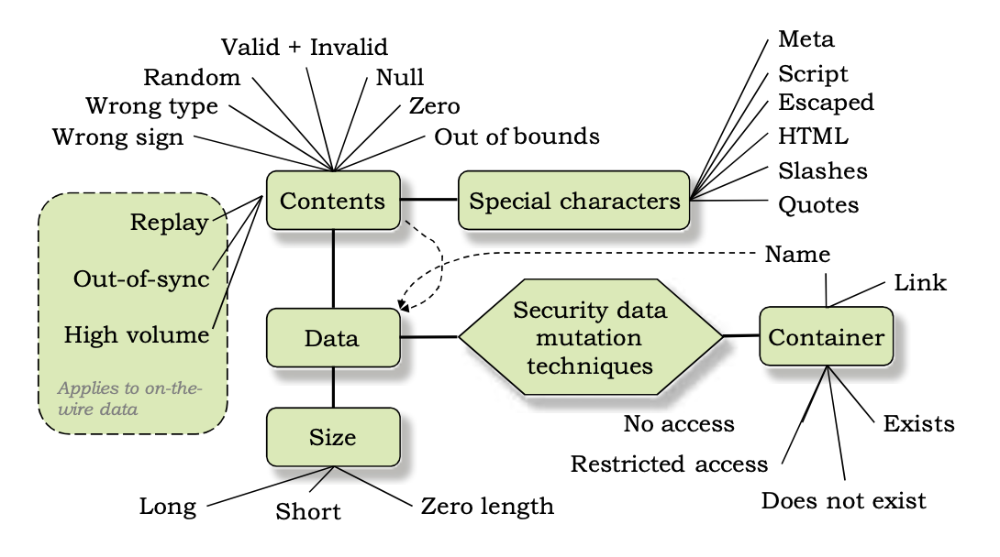

# Data Input Cases 

<!-- markdown-toc start - Don't edit this section. Run M-x markdown-toc-refresh-toc -->
**Table of Contents**

- [Security Testing Plan](#security-testing-plan)
    - [Propose a Security Testing Plan Based on Patterns.](#propose-a-security-testing-plan-based-on-patterns)
        - [Design pattern:](#design-pattern)
        - [Pattern Catalog](#pattern-catalog)
    - [Patterns](#patterns)

<!-- markdown-toc end -->

 
