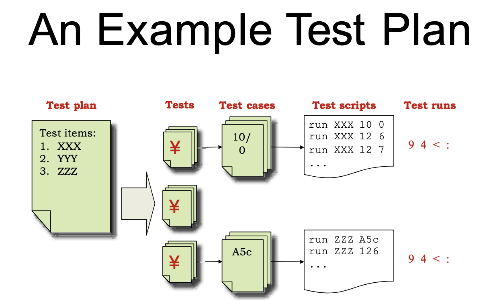
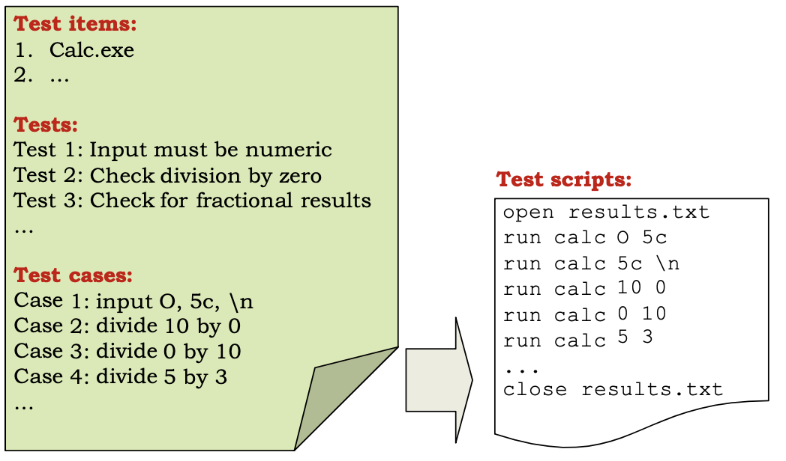

# Security Testing Plan

<!-- markdown-toc start - Don't edit this section. Run M-x markdown-toc-refresh-toc -->
**Table of Contents**

- [Security Testing Plan](#security-testing-plan)
    - [Terminology](#terminology)
    - [Testing Objectives [#security-controls]() [#security-requirement]() [#security-risk]() [#security-goals]()](#testing-objectives-security-controls-security-requirement-security-risk-security-goals)
    - [Security Team Roles and Responsibilities [#test-plan]() [#security-model]() [#testing-result]()  [#test-suite]()](#security-team-roles-and-responsibilities-test-plan-security-model-testing-result--test-suite)
    - [Propose a Security Testing Plan Based on Patterns.](#propose-a-security-testing-plan-based-on-patterns)
        - [Design pattern:](#design-pattern)
        - [Pattern Catalog](#pattern-catalog)
    - [Patterns](#patterns)
        - [Input Validation Testing](#input-validation-testing)
    - [Typical Security Testing Plan](#typical-security-testing-plan)
    - [Test Plan for Software-dependency Attacks [#software-dependency-attacks]() [#corrupt-files]() [#replace-file-attack]() [#registry-values]()](#test-plan-for-software-dependency-attacks-software-dependency-attacks-corrupt-files-replace-file-attack-registry-values)
    - [Test Plan for User-Interface Attacks [#overflow-input-buffers]() [#malformed-data]()](#test-plan-for-user-interface-attacks-overflow-input-buffers-malformed-data)
    - [Test Plan for Design Attacks](#test-plan-for-design-attacks)
    - [Test Plan for Implementation Attacks](#test-plan-for-implementation-attacks)
    - [Testing Specific Types of Applications](#testing-specific-types-of-applications)

<!-- markdown-toc end -->

A description of a software vulnerability type that includes:
* A template of a test case that exposes a vulnerability, typically by emulating what an attacker would do to exploit that vulnerability.

## Terminology
* Test procedure - manual sequence of tests
* test run - actual execution with testing script and procedures
* defect - noncomformances of the program with the functional/non-functional requirement of the specification
* audit - A review of the system to validate it.
* risk - possibility of negative undesirable occurrence.
    * impact  - the danger posed by risk
    * likelihood - the chance for a risk to occur

## Testing Objectives [#security-controls]() [#security-requirement]() [#security-risk]() [#security-goals]()
* Define security goals
* Understand security requirement
* Identify security threats
* Reduce impact if system is compromised
* Valid security controls operates as expected

## Security Team Roles and Responsibilities [#test-plan]() [#security-model]() [#testing-result]()  [#test-suite]()
* Team Lead
  * Testing process set up
  * Create test plan and test activity tracking
* Test designer
  * Security model creation
  * Write/Update test cases and suite
* Test engineer
  * Analyze test result
  * Run test cases
    

## Propose a Security Testing Plan Based on Patterns.
* Security Testing Plan Propose a security testing plan based on patterns

### Design pattern:
A description of a recurring problem and a well-defined description of the core solution to the problem

### Pattern Catalog
A collection of related patterns that apply to the same domain and contain the same elements.

## Patterns

### Input Validation Testing
* Keywords: record, enter, update, create, capture, store, edit, modify, specify, indicate, maintain, customise query, etc. 

* Targeted Vulnerabilities: SQL Injection, Path Traversal, PHP File Inclusion, etc.
* Test Procedure Template:
1. Authenticate as <kbd>registered user name</kbd>
2. Open the user interface for actioning <kbd>object</kbd>.
3. Inject one random attack from the attack list into a field of the<kbd>object</kbd>. 
4. Repeat the previous step for five attacks from the attack list. 5. Repeat the previous step for five fields from the <kbd>object</kbd>.

* Expected Results Template:
  * The system should gracefully inform the user that the input is invalid.
  * The data store for the <kdb>object</kbd> should remain intact.
  * The system shall not reveal data that is not a part of this <kdb>object</kbd>.
  * The system shall not reveal data that does not belong to this user.
  * No error messages should reveal sensitive information about the system or configuration.

## Typical Security Testing Plan
* Testing goals
  * Approach
  * Testing Process
  * Define Deliverables
* Project
  * Describe functionality, architecture, components
  * DFD, trusted boundaries
 
 ### Examples
 
 

## Test Plan for Software-dependency Attacks [#software-dependency-attacks]() [#corrupt-files]() [#replace-file-attack]() [#registry-values]()
* Third party modules (or libraries, code, etc.)
  * Block access to libraries
  * Manipulate the application's registry values
  * Force the application to use corrupt files
  * Manipulate and replace files that the application creates, reads from, writes to, or executes
  * Force the application to operate in low memory, disk-space and network-availability conditions

## Test Plan for User-Interface Attacks [#overflow-input-buffers]() [#malformed-data]()
* Malformed user input 
  * Overflow input buffers
  * Examine all common switches and options (incorrect input) 
  * Explore escape characters, character sets, and commands 
  * Testing for error handling

## Test Plan for Design Attacks 
* Vulnerabilities at design level
  * Try common defaults and test account names and passwords 
  * Expose unprotected test APIs
  * Connect to all ports
  * Create loop conditions in any application that intercepts script, code, or other user-supplied logic
  * Use alternate routes to accomplish the same task 
  * Force the system to reset values

## Test Plan for Implementation Attacks
* Create files with the same name as files protected with a higher classification
* Time of check and time of use
* Check the state of a resource before using that resource, but the state can change between the check and the use.
* Look for temporary files and screen their contents for sensitive information 
* Side-channel analysis

## Testing Specific Types of Applications
* COM, DCOM, ActiveX and RPC apps: 
  * Exercise the remote function calls with suitable malformed argument data
* File-based apps
  * Try malformed data in files
  * Try malformed file names and attributes
* Command-line apps
  * Malformed argument contents, length, number of arguments 
  * Consider argument types
* Web apps
  * Conduct bypassing, escalation , and sensitive data disclosure techniques 
  * Brute force; password complexity
