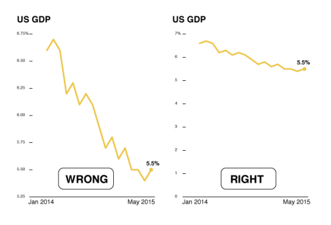
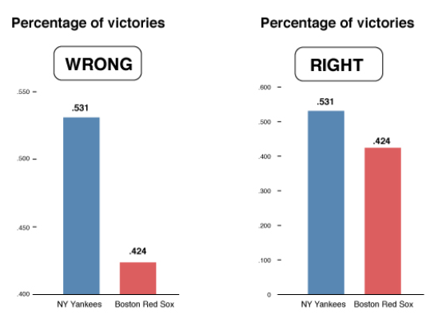
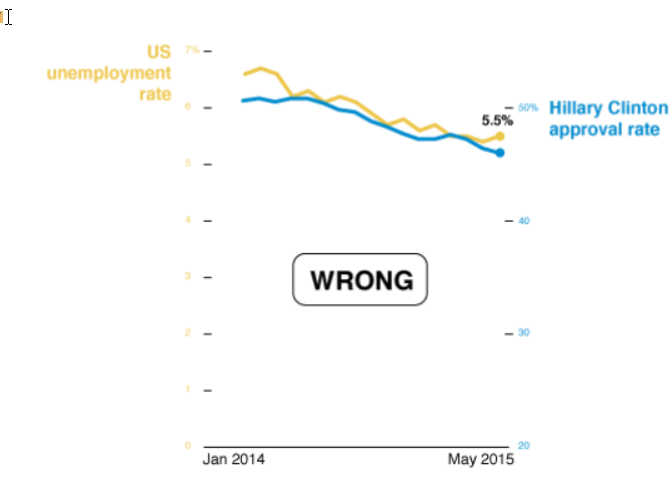
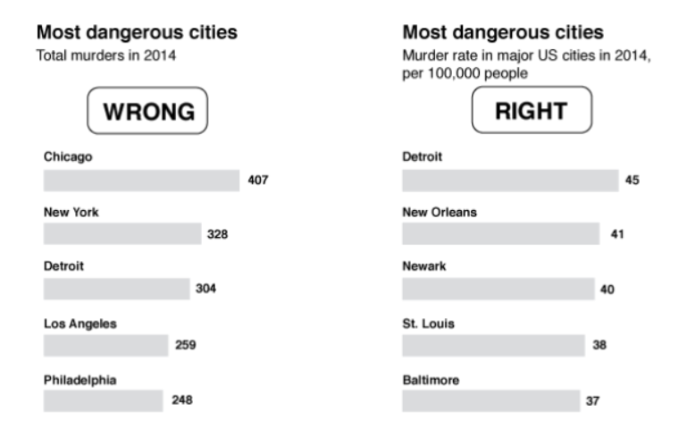

# Deceptive Practices inside Data Visualisation

<!-- markdown-toc start - Don't edit this section. Run M-x markdown-toc-refresh-toc -->
**Table of Contents**

- [Deceptive Practices inside Data Visualisation](#deceptive-practices-inside-data-visualisation)

<!-- markdown-toc end -->

## Broken Scales
* The scales are not consistent (different steps)
* Scales begin at different number on the y axis

 

 

* It does not mean we are not allowed to always break a scale.

## Showing Data on Two Different Scales
* Basically apples and oranges comparison
* Usually unintentional for example in cases where people want to include their information in less space.

## Showing Correlation can Imply Causation
* When two lines follow the same path does not always imply there is a correlation.
* It is extremely unlikely there is a correlation between Hillary Clinton approval rate and unemployment rate.

 

## Ignoring Population Size Makes Rates Impossible to Compare

* When comparing multiple cities with different population density it can cause inaccurate comparisons.

## Decorations Can be Deceptions

