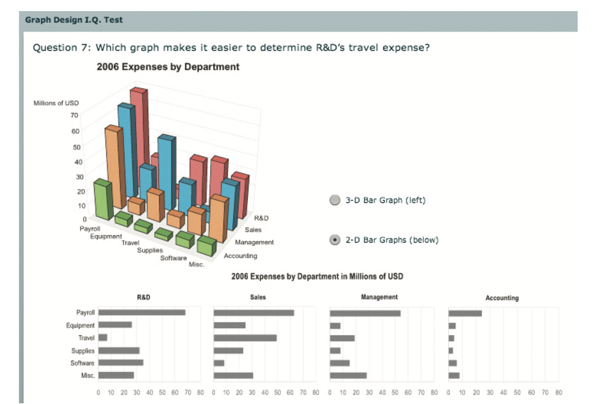
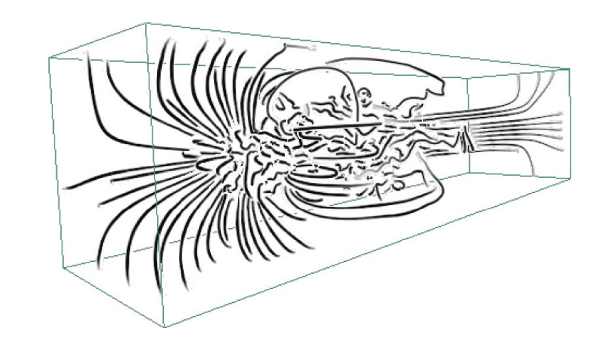
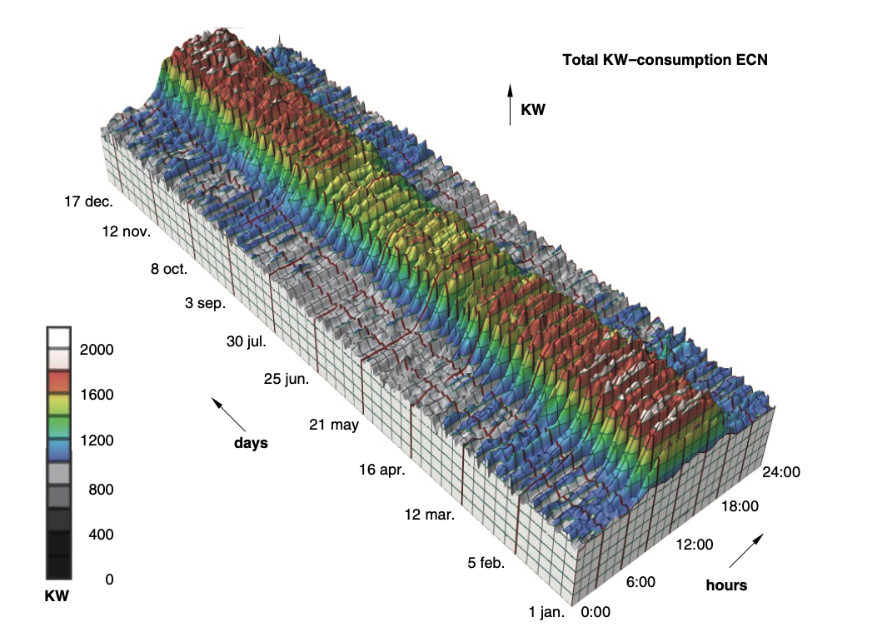
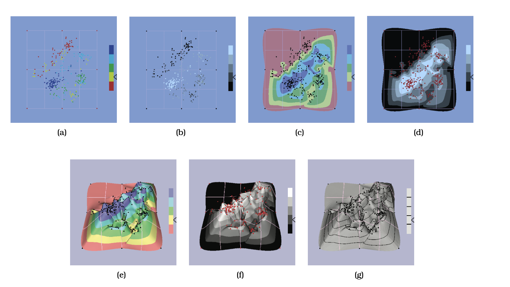

## Summary of Key Points in the Text

<!-- markdown-toc start - Don't edit this section. Run M-x markdown-toc-refresh-toc -->
**Table of Contents**

- [Summary of Key Points in the Text](#summary-of-key-points-in-the-text)
    - [The Disparity of Depth](#the-disparity-of-depth)
        - [Psychophysical Power Law Exponents](#psychophysical-power-law-exponents)
        - [Mathematical Consideration](#mathematical-consideration)
        - [Perceptual Inaccuracy](#perceptual-inaccuracy)
        - [Figure 6.2 Explanation](#figure-62-explanation)
        - [Line-of-Sight Ambiguity](#line-of-sight-ambiguity)
        - [Viewing Limitations](#viewing-limitations)
    - [Occlusion Hides Information](#occlusion-hides-information)
        - [Depth Cue: Occlusion](#depth-cue-occlusion)
        - [Motion Parallax](#motion-parallax)
        - [3D Viewpoint in Synthetic Scenes](#3d-viewpoint-in-synthetic-scenes)
        - [Time Cost](#time-cost)
        - [Hidden Information Problem](#hidden-information-problem)
        - [Cognitive Load in Unfamiliar Scenes](#cognitive-load-in-unfamiliar-scenes)
        - [Visual Encoding Challenges](#visual-encoding-challenges)
        - [User Interaction](#user-interaction)
    - [Perspective Distortion Dangers](#perspective-distortion-dangers)
        - [Definition of Perspective Distortion](#definition-of-perspective-distortion)
        - [Historical Context: Western Art](#historical-context-western-art)
        - [Impact on Visual Encoding of Abstract Data](#impact-on-visual-encoding-of-abstract-data)
        - [Examples](#examples)
        - [Additional Example: Figure 6.5](#additional-example-figure-65)
        - [Overall Conclusion](#overall-conclusion)
    - [6.3.5 Other Depth Cues](#635-other-depth-cues)
        - [Familiar Object Size](#familiar-object-size)
        - [Shadows and Surface Shading](#shadows-and-surface-shading)
        - [Stereoscopic Depth](#stereoscopic-depth)
        - [Atmospheric Perspective](#atmospheric-perspective)
    - [Tilted Text Isn't Legible](#tilted-text-isnt-legible)
    - [Benefits of 3D: Shape Perception](#benefits-of-3d-shape-perception)
    - [Justification and Alternatives for 3D Visualization](#justification-and-alternatives-for-3d-visualization)
    - [No Unjustified 3D](#no-unjustified-3d)
    - [Rules of Thumb and Layer-Oriented Time-Series Vis](#rules-of-thumb-and-layer-oriented-time-series-vis)
    - [Empirical Evidence on 3D Visualization](#empirical-evidence-on-3d-visualization)
    - [No Unjustified 2D](#no-unjustified-2d)
        - [Strengths of 1D Lists](#strengths-of-1d-lists)
        - [Limitations of 2D Layouts](#limitations-of-2d-layouts)
        - [When to Use 2D](#when-to-use-2d)

<!-- markdown-toc end -->

### The Disparity of Depth

#### Psychophysical Power Law Exponents
- Different exponents for depth and planar judgements.
- For planar spatial position, exponent (n) is 1.0, indicating high accuracy.
- For depth judgements, n is 0.67, worse than 0.7 for area judgements.

#### Mathematical Consideration
- A line extending into depth is scaled nonlinearly, causing distortions in distances and angles.

#### Perceptual Inaccuracy
- Common intuition that we see the world in 3D is misleading.
- We actually see in 2.05D, according to Colin Ware.
- Most visual information is about a 2D image plane, and depth information is minimal.

#### Figure 6.2 Explanation
- Two axes (sideways and up-down) differ fundamentally from the depth axis (toward-away).
- For the two axes, millions of rays of information can be seen.
- For the depth axis, only one point of information is visible for each ray.

#### Line-of-Sight Ambiguity
- A phenomenon where only one point along the depth axis is available for each ray, limiting the depth information.

#### Viewing Limitations
- To get more information behind closest objects, the viewpoint or objects would have to move.
- May involve just moving the head or relocating the body to a different position.

### Occlusion Hides Information

#### Depth Cue: Occlusion
- Most powerful depth cue where objects **behind others are hidden**.
- Visible objects interpreted as closer than occluded ones.

#### Motion Parallax
- Changes in occlusion relationships as we move provide understanding of relative distances.
- Does not impose cognitive load in realistic scenes.

#### 3D Viewpoint in Synthetic Scenes
- Navigation controls allow for motion parallax.
- Interactive navigation is critical in complex scenes to understand 3D structure.

#### Time Cost
- **Interactive navigation** takes longer than inspecting a single image.

#### Hidden Information Problem
- Occlusion hides potentially important information.
- **Time-consuming to discover it via navigation**.

#### Cognitive Load in Unfamiliar Scenes
- Unpredictable and **unfamiliar shapes make understanding the structure challenging**.
- Requires internal memory and synthesis of understanding from previous viewpoints.

#### Visual Encoding Challenges
- Especially problematic when spatial position is used to represent nonspatial, abstract data.
- Figure 6.3 exemplifies the challenges in understanding a 3D node–link graph.

#### User Interaction
- Sophisticated interaction idioms proposed to expedite the synthesis of understanding.

### Perspective Distortion Dangers

#### Definition of Perspective Distortion
- Distant objects appear smaller and change their planar position on the image plane.
- Also known as **foreshortening**.

#### Historical Context: Western Art
- Renaissance artists utilised the mathematics of perspective for realism.
- Perspective generally considered good in the context of art.

#### Impact on Visual Encoding of Abstract Data
- Perspective is harmful for visually encoding abstract data.
- Interferes with planar spatial position channels and size channel.

#### Examples
- Figure 6.4 shows difficulty in judging bar heights in 3D bar charts due to perspective distortion.

- Foreshortening makes direct comparison of bar heights difficult.

#### Additional Example: Figure 6.5
- Size coding in multiple dimensions leads to perspective distortion.
- Bar sizes in the distance cannot be directly compared due to the distortion.

#### Overall Conclusion
- Perspective distortion is a major issue in the context of data visualization.
- The power of the plane for visual encoding is lost.

### 6.3.5 Other Depth Cues

#### Familiar Object Size
- 🟡`Depth cue` from the size of familiar objects in realistic scenes.
- Not available for visually encoded abstract data.

#### Shadows and Surface Shading
- 🟡`Cast shadows` resolve depth ambiguity, help infer object height.
- 🟡`Shading and self-shadowing` reveal 3D shape.
- Issues:
  - Creates visual clutter.
  - Can be mistaken for true marks.
  - Interfere with 🟡`color channels` (highlights and shadows).

#### Stereoscopic Depth
- From disparities between two images made from slightly separated viewpoints.
- Considered a relatively 🟡`weak depth cue` compared to others.
- Useful for nearby objects at the same depth.
- 🟡`Stereo displays` improve depth perception accuracy.
- Doesn't solve problems with 🟡`perspective distortion`.

#### Atmospheric Perspective
- 🟡`Depth cue` where distant object color shifts toward blue.
- Conflicts with 🟡`color encoding`.

🟣 **Examples:**
- 🟣 Shadows help infer object height with respect to a ground plane.
- 🟣 Stereo displays provide different images for each eye to help resolve depth.

### Tilted Text Isn't Legible

- 🟡`Text legibility` is dramatically impaired when text is tilted in 3D space.
- Text fonts are optimized for 2D pixel grids, leading to high legibility at small sizes.
- Hardware graphics acceleration enables quick rendering, but not necessarily good legibility for tilted text.
- Tilted text becomes 🟡`blocky and jaggy` when moved off the image plane.
- Future solutions may come from careful rendering and high-resolution displays, but it remains a problem today.

🟣 **Example:**
- 🟣 Text characters as small as nine pixels are easily readable in 2D but become less legible when tilted in 3D space.

### Benefits of 3D: Shape Perception
- 🟡`3D visualization` shines when understanding three-dimensional geometric structures is fundamental to the viewer's task.
- Interactive navigation controls in 3D allow for quicker mental model construction compared to 2D axis-aligned views.
- The costs of 3D are outweighed when the benefit is understanding 🟡`3D geometry`.

🟣 **Examples:**
- 🟣 People trained to understand blueprints still find it challenging to synthesize a 3D mental model from 2D views.
- 🟣 3D is more efficient for tasks involving inherently 3D spatial data, such as fluid flow over airplane wings, medical imaging, and molecular interactions within cells.

  
- 🟣 The use of 3D is justified for tasks like understanding fluid flow patterns, as geometric navigation based on 3D rotation can help users understand complex shapes quickly.

### Justification and Alternatives for 3D Visualization

- The use of 🟡 `3D` for abstract data now demands careful justification, as the costs have become better understood.
- Often, a different approach at the 🟡 `abstraction` or 🟡 `visual encoding` levels could be more appropriate.

🟣 **Example: Time-Series Data by van Wijk and van Selow**
  - The dataset has measurements of the number of people inside and power used in an office over a year.
  - A straightforward 3D representation showed only large-scale patterns, suffering from problems like occlusion and perspective distortion.
  - Authors use multiple linked 🟡 `2D views` and different data abstraction, overcoming these issues.
  - Smaller-scale patterns, which were hidden in the 3D representation, become visible.

### No Unjustified 3D

- 3D is only justifiable in certain cases, even for 🟡 `abstract data`.

### Rules of Thumb and Layer-Oriented Time-Series Vis

🟣 **Example: Oscilloscope Time-Series by Lopez-Hernandez et al.**
  - Uses 3D with care and justification.
  - The system starts with a traditional eye diagram, showing overlapping traces.
  - The metaphor of 🟣 "opening a drawer" is used to spread the traces apart.
  - Orthographically projected layers always face the viewer.
  - Navigation complexity is managed by auto-zooming and framing as user adjusts the orientation.

### Empirical Evidence on 3D Visualization

- 🟡 `Empirical experiments` are crucial for understanding user performance in 2D vs 3D interfaces.
- There's a dissociation between stated preference for 🟡 `3D` and actual task performance.
  
  🟣 **Example: Study by Andre and Wickens 95**
  - 3D is better for shape understanding tasks.
  - 2D is superior for tasks requiring judgment of distances and angles between objects.

- Most tasks involving 🟡 abstract data do not benefit from 3D.

  🟣 **Example: 3D Cone Trees vs 2D Tree Browser**
  - The study found a significant time cost when using 3D [Cockburn and McKenzie 00].

- Experimental designs should be controlled to accurately measure the efficacy of 🟡 3D vs 2D.

  🟣 **Example: 3D Data Mountain vs 2D Favorites Display**
  - Initially, 3D outperformed 2D [Robertson et al. 98].
  - A later study found no performance benefit for 3D when other factors were controlled [Cockburn and McKenzie 01].

  
  
  🟣 **Example: 3D Landscapes vs 2D Point Cloud**
  - No benefits for using 3D landscapes over 2D point clouds [Tory et al. 07].
  
  🟣 **Example: Points vs Landscapes in High-dimensional Data**
  - Points were superior for search and point estimation tasks.
  - 2D landscapes were better than 3D [Tory et al. 07].
  - Similar results in a follow-up study for a visual memory task [Tory et al. 09].

- Other terms for 3D landscapes include 🟡 height field and 🟡 terrain.
- 🟡 `Contour plots` can be used alone or combined with 3D for a colored landscape.

### No Unjustified 2D

- Just like with 3D, laying out data in 🟡 2D space should also be explicitly justified.
- Compare 2D layouts with the alternative of 🟡 1D lists.

#### Strengths of 1D Lists
1. 🟡 Information Density: Lists show the maximal amount of information in minimal space.
2. 🟡 Lookup Tasks: Lists are excellent when ordered properly, such as in alphabetical order for label search.

  🟣 **Example: Alphabetical Ordered List**
  - Effective for finding a known label quickly.
  
#### Limitations of 2D Layouts
1. 🟡 Space Requirement: 2D layouts, like node–link representations, require more space to show the same number of labels.

  🟣 **Example: Node-Link Representation**
  - Requires user to hunt around the layout for a specific label unless a search capability is built in.

#### When to Use 2D
- 🟡 Use 2D when the task requires understanding the topological structure of the network.
- Some tasks are handled well by 🟡 linear lists, even if the original data has network structure.

### Eyes Beat Memory

- The principle is that using 🟡 eyes to switch between different views imposes a lower 🟡 cognitive load than using 🟡 memory to compare views.

#### Cognitive Load in Single View Navigation

- Navigation within a single view places cognitive load on the viewer.
  
  🟣 **Example 1: Navigational Choices**
  - If you zoomed into the nucleus, you have to remember that to maintain orientation.
  
  🟣 **Example 2: Remembering Past Views**
  - If earlier all the stock options in the tech sector were in the top corner, you have to remember that.

#### Solution: External Representation

- Using an external representation like an overview window can minimize cognitive load.

  🟣 **Example: Overview Window**
  - A small overview window with a rectangle showing the position and size of the current camera viewport for the main view allows you to just look and see your orientation, rather than needing to remember it.
  
### Memory and Attention

- 🟡 Human memory is categorized into two types: 
  1. 🟡 Long-term memory: Lasts a lifetime
  2. 🟡 Short-term memory (Working memory): Lasts several seconds
  
- 🟡 Working memory has a limited capacity, leading to 🟡 cognitive load when limits are reached. 

- 🟡 Human attention is also a limited resource.

  - 🟡 Conscious search becomes harder with more items to check.
  
  - 🟡 Vigilance degrades quickly during visual search tasks.
  
    🟣 **Example**: Worse performance in visual search tasks after several hours compared to the first few minutes.

### Animation versus Side-by-Side Views

- 🟡 Animation has multiple meanings:
  1. 🟡 Narrative storytelling (e.g., in movies)
  2. 🟡 Transitions between two states
  3. 🟡 Video-style playback (play, pause, stop, rewind, step forward/back)

- 🟡 Animation in vis (visualizations) is different from narrative storytelling in movies.
  
  - 🟣 **Example**: Movies guide viewer's eyes to one action at a time, while dataset animation might have simultaneous changes.

- 🟡 Animation is powerful for transitions between two dataset configurations.
  
  - 🟣 **Example**: Helps in maintaining context and tracking object positions or camera viewpoints.
  
  - 🟡 Limitation: Ineffective if many objects change between frames.

- 🟡 We are blind to changes in areas that are not the focus of our attention.

- 🟡 Jump cuts are hard to follow but can be useful if controlled by the user.
  
  - 🟣 **Example**: Blink comparator idiom used in astronomy to discover Pluto.

- 🟡 Multiframe animations rely on internal memory for frame comparison.
  
  - 🟡 Difficulty arises when many changes occur across many frames.
  
  - 🟡 Pausing and replaying helps but doesn't fully solve the problem.

- 🟡 Side-by-Side Views are often more effective for tasks requiring detailed frame comparison.

  - 🟡 Suitable for dozens but not hundreds of frames.
  
  - 🟡 Actions should be segmented into meaningful chunks.
  
  - 🟣 **Example**: Many vis idioms use multiple views, especially small multiples.

### Change Blindness

- 🟡 Change Blindness: We fail to notice drastic changes if our attention is directed elsewhere.
  
  - 🟣 **Example**: An experiment where a person asking for directions is replaced by another person without the individual noticing.

- 🟡 Implications for vis (visualizations): Difficulty in tracking complex and widespread changes across multiframe animations.

### Resolution over Immersion

- 🟡 Pixels are Precious: Trade-off usually favors resolution over immersion.

- 🟡 Immersive Environments: Use technology like stereo imagery, full six-degree-of-freedom head and position tracking.
  
  - 🟡 Most Common Display: Head-mounted displays or rooms with rear-projection displays.
  
- 🟡 Cost of Immersion:
  1. Lower Resolution
  2. Lack of workflow integration
  3. Physically taxing
  
  - 🟣 **Example**: Special-purpose settings that require users to leave their usual workspace.
  
- 🟡 Critical Constraint in vis: The number of pixels available on a display.

- 🟡 Rare Cases where Immersion is Useful:
  
  - 🟣 **Example**: Phobia desensitization in virtual reality.
  
  - 🟡 When 3D spatial data is the chosen abstraction.
  
- 🟡 Immersion for nonspatial, abstract data is uncommon and requires careful justification.

### Overview First, Zoom and Filter, Details on Demand

- 🟡 Ben Shneiderman's Mantra: Emphasizes the need for an overview, the need for detail, and the role of data reduction and navigation.

- 🟡 Vis Idiom for Overview: Provides a broad awareness of the entire information space with the goal to summarize.

  - 🟡 No Navigation: Ideally, shows all items in the dataset simultaneously without the need for panning or scrolling.
  
- 🟡 Role of Overviews:
  1. Help find regions for further investigation.
  2. Commonly shown at the beginning but also interleaved with detail views.
  
- 🟡 When Dataset is Large: Use some form of reduce action to show everything.

  - 🟡 Filtering and Aggregation: Two key methods for creating overviews.
  
  - 🟣 **Example**: Zooming out geometrically so the entire dataset is visible, possibly reducing the mark size to a single pixel.
  
  - 🟡 Custom Overviews: More sophisticated than simple geometric zooming, driven implicitly by navigation.
  
- 🟡 Overview vs Detail View:
  
  - 🟡 Overview: Summarizes a lot of data.
  - 🟡 Detail View: Shows fewer data items with more information.
  
  - 🟣 **Example**: Detail view pops up in response to a select action, or is permanently visible side-by-side with the overview.

- 🟡 Other Idiom Families:
  1. Single view that dynamically changes by supporting reduce actions.
  2. Embed both detailed focus and overview context within a single view.
  
- 🟡 Applicability: Mantra most useful for moderate-sized datasets.
  - 🟡 Alternative for Large Datasets: "Search, Show Context, Expand on Demand", focuses on search results as a starting point for browsing.

## Responsiveness Is Required
🟡 **Latency of Interaction**: The time it takes for a system to respond to a user's action is extremely crucial in interaction design. 

🟡 **Discrete Categories**: Human reactions to latency are best understood in discrete categories, each with its own time constant.

🟡 **Responsive Systems**: A system will be considered responsive if it aligns with these latency categories and provides timely feedback to the user.

🟡 **Time Constants**: Three main time constants are critical for visual (vis) designers:

| 🟡 Time Constant          | 🟡 Value (in seconds) |
|--------------------------|-----------------------|
| Perceptual Processing    | 0.1                   |
| Immediate Response       | 1                     |
| Brief Tasks              | 10                    |

- 🟡 **Perceptual Processing (0.1s)**: Relevant for things like screen updates.
  
- 🟡 **Immediate Response (1s)**: Important for operations like visual feedback upon selecting an item with a mouse click, or animated transitions.

- 🟡 **Brief Task (10s)**: Pertinent for breaking down complex tasks into simpler pieces with a good granularity.

> **Note**: 
> - 🟡 Chapter 12 will cover multiple views.
> - 🟡 Chapter 13 will cover approaches to data reduction.
> - 🟡 Chapter 14 will cover focus+context idioms.

🟣 **Examples**:
- **Perceptual Processing**: If a website updates its content within 0.1s, it appears highly responsive.
- **Immediate Response**: Clicking a button and instantly seeing a visual confirmation or change.
- **Brief Tasks**: Decomposing a long task, like a 60-second operation, into 10-second chunks.

## Visual Feedback
🟡 **Latency from User's Perspective**: The time between the user's action and receiving feedback from the system, indicating that the operation is complete.

🟡 **Visual Indication**: In visual systems, the feedback should be a visual change in the system's state, avoiding intrusive methods like console status messages or popup dialog boxes.

🟡 **Confirmation**: Users should get some form of confirmation that their action has completed to avoid confusion.

🟡 **Highlighting**: An effective method of providing visual feedback, such as highlighting a selected item.

🟡 **Immediate Response Latency Class**: Feedback should ideally occur within about one second to fit within this latency class.

🟡 **Progress Indicator**: If an action takes significantly longer than expected, showing some kind of progress indicator is advisable.

🟡 **Rule of Thumb**: Crossing from one latency class into another is a good indicator that a progress indicator should be shown.

> 🟡 **Note**: This ties back to the latency classes described in Table 6.1 of section 6.8.

🟣 **Examples**:
- **Visual Indication**: A button changes color to indicate it has been clicked.
- **Confirmation**: A selected item gets highlighted to confirm the operation is complete.
- **Immediate Response Latency Class**: A new frame in navigation is drawn within one second after the user changes the viewpoint.
- **Progress Indicator**: A loading spinner appears when a file is taking longer than usual to upload.

## Latency and Interaction Design
🟡 **Successful Interaction Design**: Involves matching latencies across low-level interaction mechanisms, visual feedback, system update time, and cognitive load of the operation.

### Low-Level Interaction Mechanisms
- 🟡 **Clicking**: Slowest, requires the user to move the cursor and click on the target.
- 🟡 **Mouseover with Dwell Time**: Speed depends on how long the cursor must dwell on the object.
- 🟡 **Mouseover without Dwell Time**: Fastest, triggered as soon as the cursor crosses the object.

### Visual Feedback Mechanisms
- 🟡 **Fixed Detail Pane**: High latency as it requires the user to move their eyes; but allows for detailed information.
- 🟡 **Popup at Cursor**: Faster but might occlude other objects.
- 🟡 **Visual Highlight in View**: Like highlighting neighbors in a graph, very immediate but can change the scene.

### System Update Time
- 🟡 **Tiny Datasets**: Negligible latency.
- 🟡 **Large Datasets**: Considerable latency unless optimized.
- 🟡 **Distributed Datasets**: May take several seconds due to network latency.

🟡 **Algorithmic Attention**: Designing systems to guarantee immediate response may require specialized algorithms.

🟡 **User Experience**: When all latencies are well-matched, the user stays in a state of flow. Mismatches can disrupt this.

> 🟡 **Note**: The term *rendering* is used in computer graphics for drawing an image. 

🟣 **Examples**:
- **Clicking**: Moving mouse to a folder and clicking to open it.
- **Mouseover with Dwell Time**: Hovering over a hyperlink to display a preview.
- **Mouseover without Dwell Time**: Moving mouse over a menu item to immediately show sub-menus.
- **Fixed Detail Pane**: Clicking on an email to read its content in a pane on the side.
- **Popup at Cursor**: Hovering over a word to show its definition in a popup.
- **Visual Highlight in View**: Hovering over a node in a graph to highlight all connected nodes.
- **Tiny Datasets**: A locally-stored document opens almost instantly.
- **Large Datasets**: A complex 3D model takes time to load and render.
 **Distributed Datasets**: Fetching a file from a cloud server with high latency.

## Interactivity Costs

🟡 **Power and Cost of Interactivity**: Interaction allows users to explore larger information spaces but comes at the cost of human time and attention.

🟡 **Human-Powered Search**: If users have to manually check every possibility, the vis system's utility diminishes.

🟡 **Automatic Feature Detection**: A useful goal for designers to bring features of interest to the user's attention automatically via visual encoding.

🟡 **Trade-off**: There's always a balance between automatable aspects and the need for human pattern detection in interactive systems.

> 🟡 **Note**: If a task can be fully automated, the need for a vis system becomes irrelevant.

🟣 **Examples**:
- **Power of Interactivity**: Navigating through different layers of a complex dataset.
- **Cost of Interactivity**: Time spent manually filtering data points.
- **Human-Powered Search**: Manually checking each item in a list to find anomalies.
- **Automatic Feature Detection**: The system highlighting outliers in a dataset automatically.
- **Trade-off**: Choosing between an automated sorting algorithm and manual sort by a user to identify meaningful patterns.

## Get It Right in Black and White

🟡 **Design Guideline**: Maureen Stone suggests that effective use of color should start with black and white legibility.

🟡 **Legibility**: Crucial visual aspects should be understandable even when transformed from full color to black and white.

🟡 **Checking Work**: Validate design by literally viewing it in black and white, either via image processing or a black and white printer printout.

🟡 **Luminance Channel**: Focus on encoding the most important attributes with luminance to ensure contrast.

🟡 **Hue and Saturation**: These should be considered secondary sources of information.

> 🟡 **Note**: The primary focus is to ensure the image is effective in black and white first before adding color.

🟣 **Example**: 
- Before finalizing a colored heatmap, check its legibility by viewing it in black and white. Make sure the important data points are still distinguishable.

## Function First, Form Next

The priority in vis (visual representation) design should be on function first, followed by form.

### Rationale:

1. 🟡 **Effective but Ugly**: An effective but aesthetically unpleasing design can be refined for beauty while keeping its effectiveness.
2. 🟡 **Beautiful but Ineffective**: A beautiful yet ineffective design will likely need to be tossed out and redesigned from scratch.

🟡 **Collaboration**: A designer without graphic design training can collaborate with those who do to improve the form.

🟡 **Form Never**: The author doesn't advocate ignoring form altogether, as good visual form enhances effectiveness.

🟡 **Preference**: Given a choice between two equally effective systems, people will prefer the one with better visual form.

🟡 **Book's Focus**: The book emphasizes vis. effectiveness due to the scarcity of resources on this subject, rather than covering the principles of graphic design which are well-covered elsewhere.

🟣 **Example**:
- Given two dashboards that display the same data effectively, users are more likely to engage with the one that also has a more visually appealing design.
