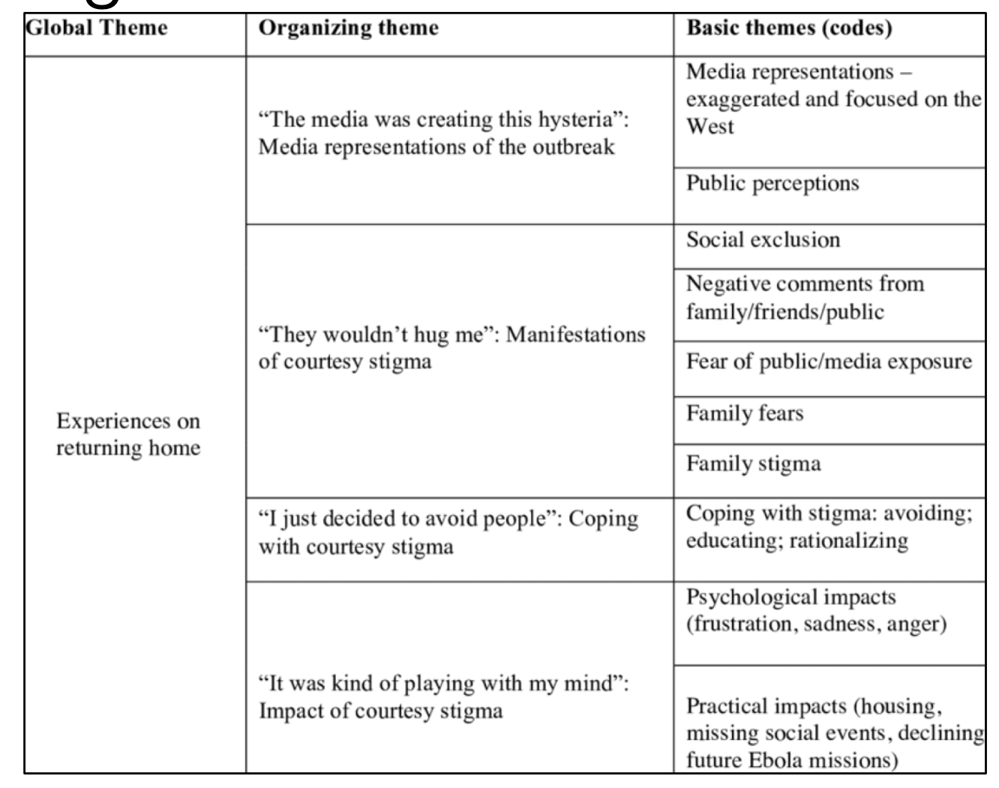
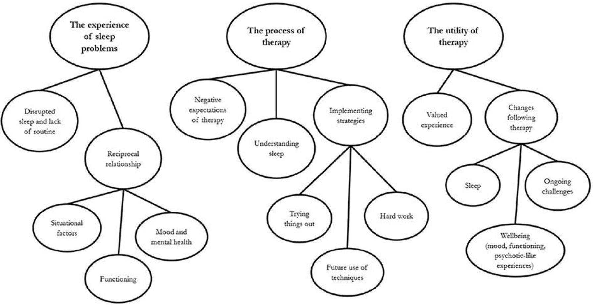

# Qualitative Analysis

<!-- markdown-toc start - Don't edit this section. Run M-x markdown-toc-refresh-toc -->
**Table of Contents**

- [Qualitative Analysis](#qualitative-analysis)
    - [Why Qualitative Analysis?](#why-qualitative-analysis)
    - [Types](#types)
        - [Content Analysis](#content-analysis)
    - [Challenges in Qualitative Analysis](#challenges-in-qualitative-analysis)
    - [Thematic Analysis](#thematic-analysis)
        - [Types](#types-1)
    - [More Considerations: Latent or Semantic Themes](#more-considerations-latent-or-semantic-themes)

<!-- markdown-toc end -->

## Why Qualitative Analysis?
* Making sense of a phenomenon
* Difficult to be precisely measured
* Depends on the context of the research topic

## Types
### Content Analysis
* **What it is**: A method for **studying documents** and other forms of communication.
* **Meaning**: The focus is on how messages within the texts are constructed and what they reveal about social reality.
* **Purpose**: Commonly used to examine meanings contained in contents of a communication.
* **Examples**: **Analyzing newspaper articles** to assess representations of gender roles, studying tweets to gauge public opinion.

* **Narrative Analysis**
  * **What it is**: A method focused on the **ways people tell stories**.
  * **Meaning**: Examines the structure, content, and the delivery of narratives to understand social phenomena.
  * **Examples**: **Studying personal diaries** to understand the **emotional impact of events**, interviewing people to get **life stories**.

* **Conversation Analysis**
  * **What it is**: A study of **how people use language in everyday interactions**.
  * **Meaning**: Focuses on the details of conversation, such as turn-taking, pauses, and other non-verbal signals.
  * **Examples**: Analyzing a recorded meeting to study how decisions are made, studying doctor-patient consultations.
  * Also **pays attention to nonverbal cues** and **sequences** in which the interactions take place.

* **Discourse Analysis**
  * **What it is**: A broader form of studying language in use, often beyond single conversations.
  * **Meaning**: Looks at larger units like texts or a set of conversations to **see how language constructs social reality**.
  * **Examples**: Analyzing a set of political speeches to understand the framing of issues, examining courtroom dialogue.
  * Base on the premise that our world is shaped by social interactions and texts made available to us

* **Interpretive Phenomenological Analysis**
  * **What it is**: A method focused on understanding **human experiences from the viewpoint** of those who experience them.
  * **Meaning**: Tries to get "inside the head" of participants to understand how they perceive their world.
  * **Examples**: Interviewing patients about their experiences of illness, studying first-person accounts of events.
  * Researchers try to seclude their own perceptions about the information provided by participants.

* **Grounded Theory**
  * **What it is**: A method for developing theories grounded in **empirical data**.
  * **Meaning**: Involves iterative data collection and analysis to build theories.
  * **Examples**: Interviewing employees to develop a theory of workplace motivation, using observations to build a theory of classroom dynamics.
  * Researchers would find themes through rigorous coding and reviewing of data

* **Thematic Analysis**
  * **What it is**: A method for identifying and **analyzing patterns or themes within qualitative data**.
  * **Meaning**: Themes are **identified across data sets and analyzed**.
  * **Examples**: Coding and analyzing transcripts from focus groups to **find common themes about a product**, studying repeated motifs in literature.

## Challenges in Qualitative Analysis
* Protecting **privacy confidentiality** and **anonymity** of participants
* Ensuring “r**esearch integrity** and quality”
* “Ownership of data”
* Ethics

## Thematic Analysis

> “Thematic analysis is a method for identifying, analysing and reporting patterns (themes) within data”
> - Braun and Clarke (2006)

### Types
* What type of analysis?
  * **rich description** of the data set, or
  * detailed account of one particular aspect 

* What type of thematic analysis?
  * **Inductive** (bottom-up) 
  * theoretical (through a “lens”)

## Latent vs Semantic Themes in Thematic Analysis
| Semantic Themes                                        | Latent Themes                                        |
|:------------------------------------------------------:|:----------------------------------------------------:|
| Explicit or surface                                    | Interpretative                                       |
| Based on what the **participant says**                 | Based on **underlying ideas and assumptions**        |
| Data is organized to **reflect patterns and meanings** | Analysis is not a **description but a theorization** |

## More Considerations of Thematic Analysis

The different questions:
• Research questions
• Interview questions
Domain summaries vs. shared meaning-based patterns:
• “Buckets” that are no more than domain summaries (LESS DEVELOPED)
• “Story Books”, that get under the surface of issues (WELL-DEVELOPED)

## Phases of thematic analysis
1. Defining and naming themes
2. Reviewing themes
3. Searching for themes
4. Familiarising yourself with your data
5. Generating initial codes

### Phase 1: familiarizing yourself with your data
* Verbal data needs transcribing
* Transcribe your data as necessary
* Punctuation matters!
* Immerse yourself in the data

### Phase 2: Generating initial codes
Produce **initial codes for the data Coding** can be **data-driven or theory-driven Work systematically** through the data set
* Refer to the most basic elements
* Semantic or latent coding
* Not as broad as 

### General Advice
Code for as **many potential themes/patterns** as possible
Code extracts of data inclusively (retain context)
An extract may be un-coded, coded once, or coded many times

### Example: Coding

### Phase 3: Searching for themes
* **Organizing Codes and Themes**
  * Sort the long list of codes into potential themes.
  * Collate all the relevant data extracts within identified themes.

* **Evaluating Themes**
  * Consider the relationships: What makes 'Good' themes?
  * No "guidelines" as to how many themes should be selected.

* **Finalization**
  * End the phase with a collection of themes, sub*themes, and extracts.

* **Data Preservation**
  * But... don't throw anything away!

### Example: Thematic Mapping 
 

### Phase 4: Reviewing themes Refinement of themes
* Two levels of review:
  ** Reviewing at the level of the coded data extracts
  ** Reviewing themes in relation to the entire data set Refine the thematic map until you are satisfied

## Phase 6: Producing the report
* Convincing story
* Avoid repetition
* Provide extracts to justify your themes
* Description vs. argument

## Common Pitfalls in Thematic Analysis
- **Failure to Analyze Data**: Lack of in-depth analysis.
- **Using Data Collection Questions as Themes**: Themes are not derived from the actual data.
- **Weak or Unconvincing Analysis**: Themes overlap or lack a central concept.
- **Mismatch between Data and Analytic Claims**: The extracts tell a different story than the analysis.
- **Mismatch between Theory and Analytic Claims**: The form of thematic analysis doesn't align with the research questions or theoretical framework.

## Advantages of Thematic Analysis
- **Flexibility**: Adaptable to various research contexts.
- **Easy to Learn**: Accessible for beginners.
- **Educating the Public**: Useful for public awareness.
- **Policy Development**: Informative for shaping policies.
- **Different Perspectives**: Offers multiple ways to look at data.
- **Participatory Research**: Useful for involving community or stakeholders.
- **Unanticipated Insights**: Generation of unexpected findings.

## Criteria for Good Thematic Analysis
- **Analysis**
  - Proper interpretation, not just paraphrasing.
  - Matching analysis with data.
- **Coding**
  - Equal attention to all data items.
  - Comprehensive process.
  - Inclusion of all relevant extracts.
- **Transcription**
  - Appropriate level of detail.
  - Accuracy.
- **Overall**
  - Time allocation for all analysis phases.
- **Written Report**
  - Defined approach.
  - Consistency in method and analysis.
  - Epistemological consistency.
  - Active researcher positioning.

## Going Beyond Surface Data
- Questions to ask:
  - What does this theme mean?
  - What are the assumptions underpinning it?
  - What are the implications?
  - What conditions likely gave rise to it?
  - Why is it talked about in this way?
  - What is the overall story revealed by the themes?

## Examples of Thematic Analysis
- **Google Glass & Parkinson's Study**
  - Method: Workshops and field trials.
  - Data Collection: Audio-recorded interviews.
  - Analysis: Inductive thematic analysis on transcribed data.
